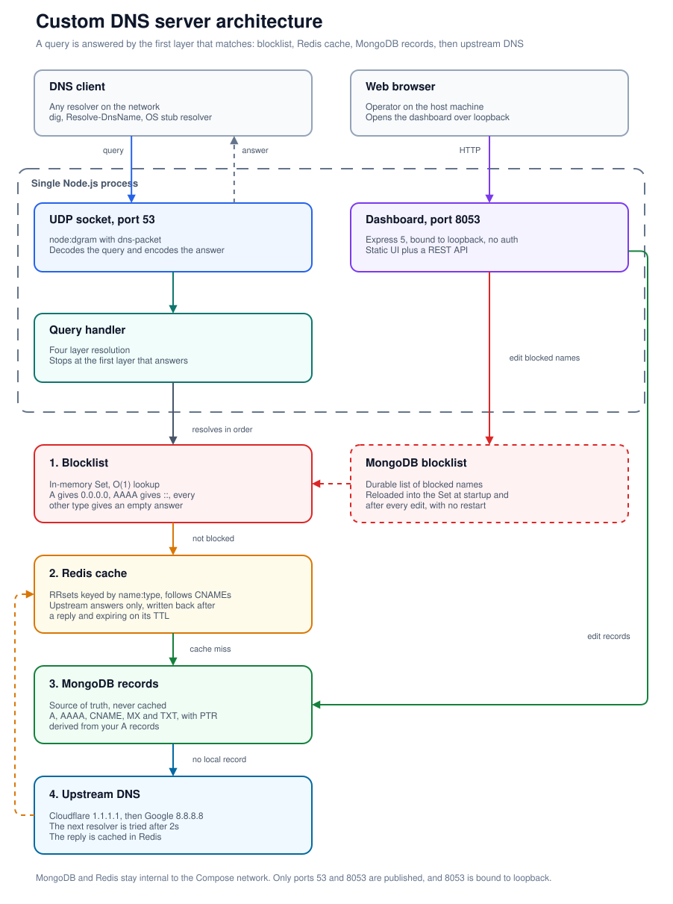

# Custom DNS Server

A high-performance DNS server with custom record management and domain blocking capabilities. Features intelligent query routing with MongoDB-backed storage for custom DNS records, Redis caching for fast lookups, and automatic upstream fallback to public DNS servers. Built with Node.js for home labs, development environments, and network management.

## Features

- **Management Dashboard**: Built in web UI for adding, editing and deleting records and blocked domains
- **Fast Response Times**: Redis caching for frequently queried domains
- **Domain Blocking**: MongoDB-based blocklist for ad/malware blocking
- **Upstream Forwarding**: Falls back to public DNS servers (Cloudflare, Google DNS) for unknown queries
- **Custom Records**: Support for A, AAAA, MX, TXT and CNAME records, plus PTR answers derived from your A records
- **In-Memory Blocklist**: O(1) lookup performance for blocked domains loaded in memory from MongoDB

## Architecture



The dashboard runs inside the DNS server process. That is what lets a blocklist edit refresh
the in-memory set directly, with no restart.

## How It Works

The DNS server processes queries through a multi-layered resolution strategy for optimal performance and control:

### Query Resolution Flow

1. **Blocklist Check** (In-Memory set loaded from Mongo DB)
   - First line of defense against unwanted domains
   - O(1) lookup using in-memory Set
   - An `A` query gets `0.0.0.0`, an `AAAA` query gets `::`, and every other type
     gets an empty answer, all with a fixed 300 second TTL

2. **Cache Lookup** (Redis)
   - Previously resolved queries are cached with TTL
   - Follows CNAME chains automatically
   - **Only caches upstream responses** - your custom records are never written here
   - Dramatically reduces response time for repeated queries

3. **Custom Records** (MongoDB)
   - Checks for user-defined DNS records
   - Supports A, AAAA, MX, TXT, CNAME records, and answers PTR queries from your A records
   - **Never cached** - ensures instant updates when you modify records
   - Perfect for home lab services and custom domains

4. **Upstream Forwarding** (Cloudflare / Google DNS)
   - If not found in previous layers, forwards to public DNS
   - If the first resolver does not answer within 2 seconds, the next one is tried
   - Response is cached for future queries
   - Ensures full DNS coverage for all domains

### Design Decisions

**Why Custom Records Aren't Cached:**

- **Instant Updates**: Changes to MongoDB records take effect immediately
- **No Stale Data**: Always serve the latest version of your custom records
- **Zero Cache Invalidation**: Eliminates the complexity of cache invalidation logic
- **Predictable Behavior**: What you see in the database is what gets served

**What Gets Cached:**

- Only responses from upstream DNS servers (Google, Cloudflare, etc.)
- Cached with original TTL values from upstream
- Automatically expires based on DNS TTL

**One Caveat, Cache Is Checked Before MongoDB:**

The cache layer runs ahead of the database layer, so a name that upstream already answered
for stays served from Redis until that entry expires. This never affects private names such
as `myapp.home`, because upstream has no answer to cache. It does matter if you add a record
to override a **public** domain you have already queried through this server: the cached
upstream answer wins until its TTL runs out. Flush the key (or wait out the TTL) if you need
the override to apply right away.

## Prerequisites

- Docker
- Docker Compose

For development mode without Docker you also need Node.js 22 or newer, plus MongoDB and Redis
reachable from your machine.

**Note for Windows Users**: Port 53 is often used by Windows DNS services, which may cause conflicts. If you ran into port already used issue, you can run the DNS server on a different port by setting `PORT` (e.g. `PORT=5353`) and changing the published port in `compose.yaml`, or use WSL2 for a better experience.

## Quick Start

1. Clone the repository:

```bash
git clone https://github.com/neerajann/dns-server.git
cd dns-server
```

2. Start all services:

```bash
docker compose up -d
```

3. Test the DNS server:

```bash
dig @localhost example.com
```

4. Open the dashboard at `http://localhost:8053`

### Development Mode

To run in development mode with auto-reload:

```bash
npm install
npm run dev
```

Make sure MongoDB and Redis are running locally, then copy `.env.example` to `.env` and fill
in your connection strings.

## Managing DNS Records

Open the dashboard at `http://localhost:8053`.

It runs inside the DNS server process and is published on loopback only, so it has no
authentication. Do not expose port 8053 to a network you do not trust.

### Add DNS Records

1. Open `http://localhost:8053`
2. Click **Add record**
3. Pick a type, enter the name and content, then Save

The type you pick changes the content field. A and AAAA take one address per line, CNAME
takes a single target, TXT takes one value per line, and MX gives you a numeric priority
next to each mail server. Leave TTL blank for **Auto** (50 seconds).

Records are grouped one row per domain and type, so a name with two A records is a single
row with both addresses. Edits apply to the next query immediately, since database records
are never cached. The one exception is a public domain you are overriding, which stays
cached until its upstream TTL expires.

PTR is not in the type list on purpose. Reverse lookups are answered automatically from
your existing A records, so a manually added PTR record would never be read.

### Add to Blocklist

1. Open the **Blocklist** tab
2. Paste domains into the box, one per line
3. Click **Block domains**

Hosts file lines such as `0.0.0.0 ads.example.com` work too, and the IP prefix is stripped
for you. Invalid entries are skipped and reported instead of failing the whole paste.

**No restart is needed.** The dashboard reloads the in-memory blocklist as part of the
request, and the domain count shown is the live count the DNS query path is using.

### Record document shape

The dashboard writes documents in this shape, which is also what you would see in MongoDB:

```json
{
  "name": "myapp.local",
  "records": [
    {
      "type": "A",
      "content": ["192.168.1.100"]
    }
  ]
}
```

`content` is always an array, even for a single value, and `ttl` is only present when you
set one explicitly.

### HTTP API

The dashboard is a thin client over these endpoints, useful for scripting bulk changes:

| Method   | Endpoint                         | Purpose                                |
| -------- | -------------------------------- | -------------------------------------- |
| `GET`    | `/api/records?q=&type=`          | List records as flat rows, plus totals |
| `POST`   | `/api/records`                   | Create a record                        |
| `PATCH`  | `/api/records/:name/:type`       | Replace a record's content and TTL     |
| `DELETE` | `/api/records/:name/:type`       | Delete a record                        |
| `GET`    | `/api/blocklist?q=&page=&limit=` | List blocked domains, 50 per page      |
| `POST`   | `/api/blocklist`                 | Block one or many domains              |
| `DELETE` | `/api/blocklist/:name`           | Unblock a domain                       |

## Supported Record Types

| Type  | Description    | Content Format                                     |
| ----- | -------------- | -------------------------------------------------- |
| A     | IPv4 address   | `["192.168.1.1"]`                                  |
| AAAA  | IPv6 address   | `["2001:db8::1"]`                                  |
| CNAME | Canonical name | `["alias.example.com"]`                            |
| MX    | Mail exchange  | `[{exchange: "mail.example.com", preference: 10}]` |
| TXT   | Text record    | `["v=spf1 include:_spf.example.com ~all"]`         |
| PTR   | Reverse DNS    | Not stored, answered from your A records           |

**Note**: The `content` field is always an array, even for single values. Names are stored
lowercased and without a trailing dot, and wildcards are rejected because lookups match
exactly. TTL accepts 0 to 604800 seconds, or blank for Auto (50 seconds).

## Testing Your DNS Server

### Using dig (Linux/macOS/WSL)

```bash
# Query A record
dig @localhost nodepost.home

# Query MX record
dig @localhost nodepost.home MX

# Query TXT record
dig @localhost nodepost.home TXT
```

### Using PowerShell (Windows)

```powershell
# Query A record
Resolve-DnsName -Name nodepost.home -Server localhost -Type A

# Query MX record
Resolve-DnsName -Name nodepost.home -Server localhost -Type MX

# Query TXT record
Resolve-DnsName -Name nodepost.home -Server localhost -Type TXT
```

## Docker Services

`compose.yaml` defines three services:

- **DNS Server**: Main application (port 53, UDP and TCP) plus the dashboard (port 8053, published on loopback only)
- **MongoDB**: Database for records and blocklist
- **Redis**: Cache layer

MongoDB and Redis publish no ports to the host. They are reachable only from the DNS server
over the Compose network, so the only listeners you expose are 53 and 8053. MongoDB data
persists in the `mongo-dns-data` volume; the Redis cache is deliberately not persisted.

### Useful Commands

```bash
# Start all services
docker compose up -d

# View logs
docker compose logs -f dns-server

# Stop all services
docker compose down

# Restart DNS server
docker compose restart dns-server
```

## Configuration

All settings are environment variables. `compose.yaml` sets the ones the container needs; for
`npm run dev` copy `.env.example` to `.env`.

| Variable         | Default     | Purpose                        |
| ---------------- | ----------- | ------------------------------ |
| `MONGO_DB_URL`   | _required_  | MongoDB connection string      |
| `REDIS_HOST`     | _required_  | Redis host name or IP          |
| `REDIS_PORT`     | `6379`      | Redis port                     |
| `PORT`           | `53`        | Port the DNS server listens on |
| `DASHBOARD_PORT` | `8053`      | Port the dashboard listens on  |
| `DASHBOARD_HOST` | `127.0.0.1` | Interface the dashboard binds  |

The DNS server always binds `0.0.0.0` so it can answer other machines on your network. The
database name is always `dns`, taken from the code rather than the URL path.

`DASHBOARD_HOST` defaults to loopback so `npm run dev` never exposes the dashboard to your
LAN. Compose sets it to `0.0.0.0` inside the container and publishes `127.0.0.1:8053:8053`,
which keeps it reachable only from the host.

If the dashboard port is already taken, the DNS server logs the failure and keeps serving
DNS.

### Upstream DNS Servers

Modify `config/constant.js` to change upstream DNS providers:

```javascript
export const UPSTREAM_DNS = [
  { address: '1.1.1.1', port: 53 }, // Cloudflare DNS
  { address: '8.8.8.8', port: 53 }, // Google DNS
]
```

Servers are tried in order. The first entry gets every query, and the next one is used only
if no reply arrives within 2 seconds.

## Use Cases

- **Home Lab DNS**: Manage custom domains for your home network and internal services
- **Development Environment**: Local DNS for microservices, testing, and dev workflows
- **Ad Blocking**: Block advertising and tracking domains network-wide
- **Mail Server Setup**: Configure MX, SPF, and DKIM records for email infrastructure
- **Network Filtering**: Control domain access and implement parental controls
- **Performance Optimization**: Cache frequently accessed DNS records for faster resolution
- **Custom CDN/Load Balancing**: Route traffic to specific servers based on domain names
- **IoT Device Management**: Assign friendly domain names to IoT devices on your network
- **Privacy Enhancement**: Prevent DNS queries from leaking to ISP by using your own resolver
- **Local Service Discovery**: Enable easy access to local services without remembering IP addresses
- **Testing DNS Changes**: Test DNS configurations before deploying to production

## Author

**Nirajan Paudel**

- LinkedIn: [n3erajan](https://www.linkedin.com/in/n3erajan)
- GitHub: [@n3erajann](https://github.com/n3erajann)
